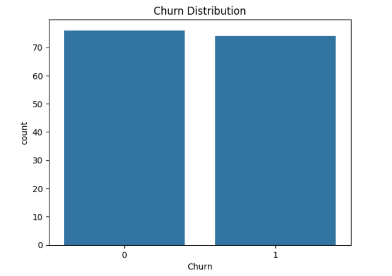
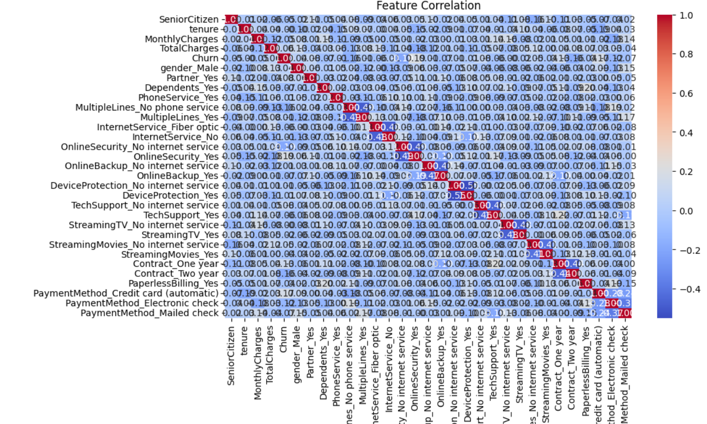
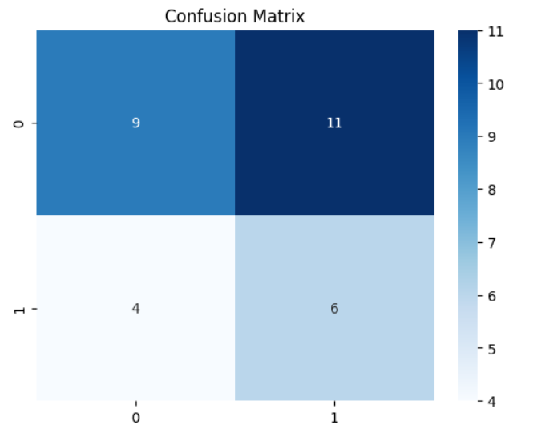
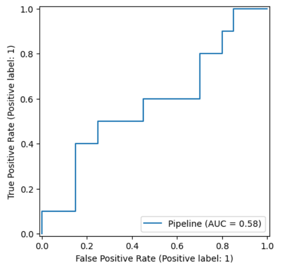

# Telecom Customer Churn Prediction

Python | Machine Learning | Streamlit | Predictive Analytics

## Project Overview
Developed a telecom churn prediction solution to identify customers at high risk of attrition and support data-driven retention strategies using machine learning and exploratory data analysis.

The project focuses on analyzing customer behavior, identifying churn drivers, and enabling proactive customer retention planning.

---

## Business Objectives
- Identify high-risk churn customers
- Analyze behavioral patterns contributing to churn
- Support customer retention decision-making
- Evaluate factors impacting customer loyalty

---

## Tools & Technologies
- Python
- Pandas
- NumPy
- Scikit-learn
- Streamlit
- Jupyter Notebook

---

## Dataset
- Telecom customer behavioral dataset
- Customer demographics, service usage, billing, and support-related attributes

---

## Technical Implementation

### Data Processing
- Data cleaning and preprocessing
- Handling missing values and categorical encoding
- Feature engineering and transformation

### Machine Learning
- Churn classification modeling
- Feature importance analysis
- Model evaluation and prediction workflow

### Visualization & Insights
- Customer churn trend analysis
- Behavioral segmentation
- Retention-focused business insights

---

## Key Insights
- Identified high-risk churn customer segments
- Detected elevated churn among short-tenure customers
- Analyzed customer service and billing-related churn drivers
- Supported proactive retention strategy planning

---

## Visualization Preview

### Churn Distribution

### Feature Correlation Heatmap

### Confusion Matrix

### ROC Curve

---

## Repository Contents
- Dataset
- Jupyter Notebook
- Source Code
- Streamlit Application
- Requirements File

---

## Skills Demonstrated
Python • Machine Learning • Predictive Analytics • Data Cleaning • EDA • Feature Engineering • Streamlit • Customer Analytics • Business Intelligence
